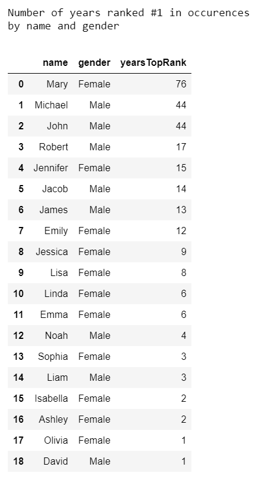
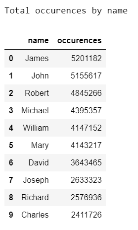
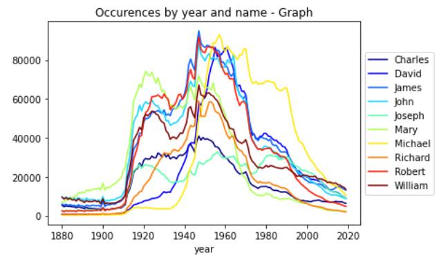
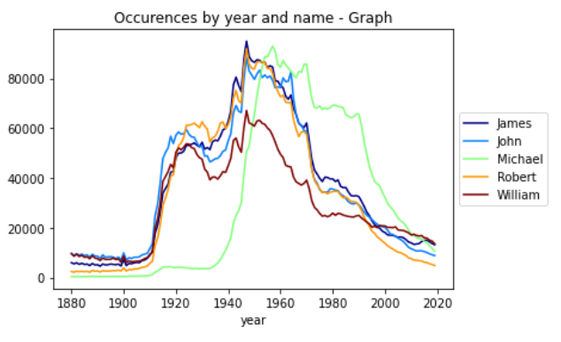
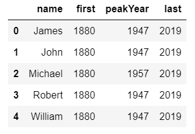
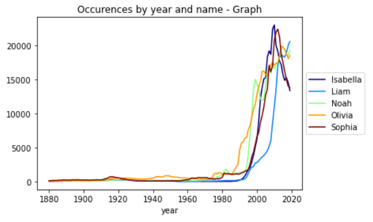
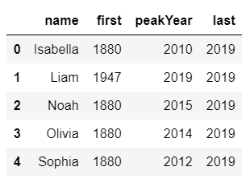
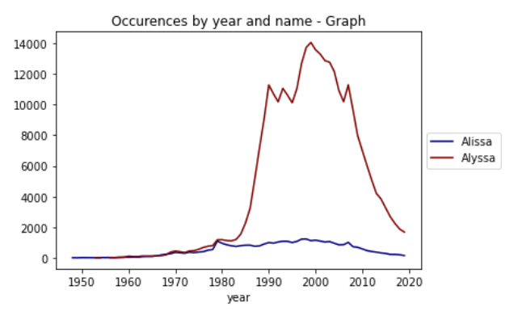

# FINAL PROJECT

## Social Security Administration Names database.

The Social Security Adminsitration has name, gender and occurences* data available for each year of birth after 1879.
This data is available in .txt files as national data (one file per year), state data (one file per state), and territory data (one file per territory).
I have chosen to work with national data for this project.  *To safeguard privacy, the SSA restricts the list of names to those with at least 5 occurrences.
https://www.ssa.gov/oact/babynames/limits.html

## Key data points for overall data

- At the time of this project there were 140 years of data available including 1880 through 2019. 
- The total number of unique names found were 99,444 with 355,149,899 occurences. 
- The unique name count among females was 68,332 with 175,768,302 occurences.
- The unique name count among males was 42,054 with 179,381,597 occurences.

      
---
In 140 years, only 19 unique names rose to the top each year, 11 unique names among females and 8 among males. Although Mary held the top spot the most often at 76 years, in overall occurences Mary ranked #6. Tied for second most often at number one, John and Michael each held the top spot in 44 years. James, the overall most popular name held the top spot in 13 years.

The bottom 5 overall among the top ranked names just started to rise in the last 20 years, while the top 5 overall among the top ranked names hit their peak in the 1947 with the exception of Michael which peaked in 1957.

   
 
    
 
 **_Top and bottom 5 total occurence among top ranked names_**  
 
 
 
## Next Steps
Further research on the subject may show how historical events and popculture can influence the popularity of a name.  Take my name for instance. My name spelled with an i is not as popular as spelled with a y, however both spellings started within a few years of each other.  Alissa was the most popular until around the 1960s and there was a small but notable tick up in popularity in 1979 for both spellings. In the mid to late 80s Alyssa took off becoming signigicanlty more popular than the i spelling by far, until the early 2000s when both spellings began to decline in popularity.  Is this mid 80s boost in popularity possibly related to a hit TV show at the same time starring Alyssa Milano?  

